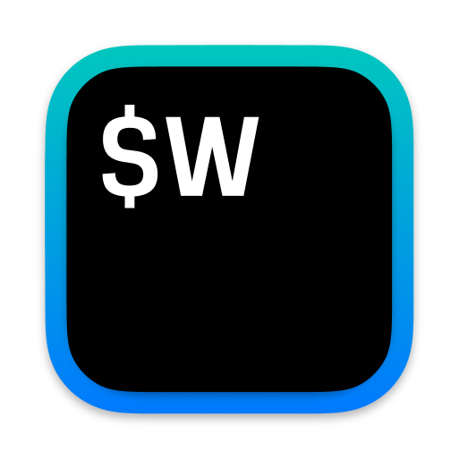
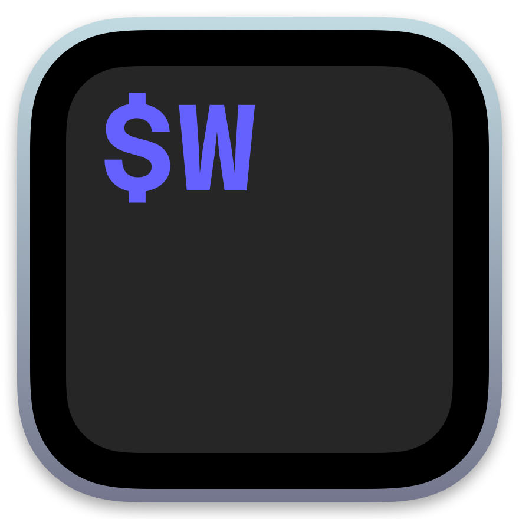

# WezTerm - Windows builds using alternative icons

**This repo** will sync with wezterm/weztern and compile a windows zip distro for each of a set of custom icons.

If you want to add an icon png (`size <= 1024x1024 && size >= 512x512`) open a pull request, and get some 👍 for it!

# Alternate Icons

see also wezterm/wezterm#2396

> Dear icon creators, thank you for making these,  I didn't want them to go to waste.  
> If you'd like them removed from the project, for whatever reason. You can let me know by @jasonm23 in wezterm/wezterm#2396

### wezterm-icon-Shine.png

credit: [@gf3](https://github.com/gf3)

  

### wezterm-icon-Base.png

credit: [@grapao](https://github.com/grapao)

  

### wezterm-icon-Flatter.png

credit: [@mikker](https://github.com/mikker)

  

### wezterm-icon-Forest.png

credit: [@grapao](https://github.com/grapao)

  
