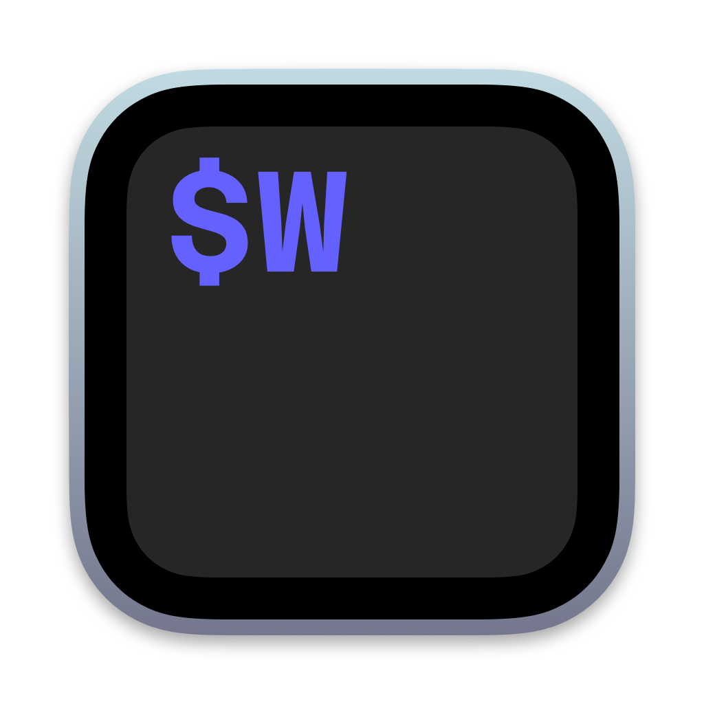

# WezTerm - Windows builds using alternative icons

**This repo** will sync with wezterm/weztern and compile a windows zip distro for each of a set of custom icons. 

If you want to add an icon png (`<= 1024x1024 && >= 512x512`) open a pull request, and get some 👍 for it!

#### Notes/Motivation:

If there are no releases, this is still _**work in progress**_

`rcedit.exe` doesn't seem to patch the `wezterm-gui.exe` icon correctly, I'm making this experimental repo to run builds with `assets/Windows/terminal.ico` replaced with each `png` in `/icons`.

NO OTHER CHANGES - review build/workflow code in `./.github/workflows/*` and `./src/*`

The build process will be an extract of wez's `...workflows/gen_windows_continuous.yml`

# Alternate Icons

see also wezterm/wezterm#2396

### icons/wezterm-icon-Shine.png

credit: https://github.com/gf3

  

### icons/wezterm-icon-Base.png 

credit: https://github.com/grapao

  

### icons/wezterm-icon-Flatter.png 

credit: https://github.com/mikker

  

### icons/wezterm-icon-Forest.png 

credit: https://github.com/grapao

  
