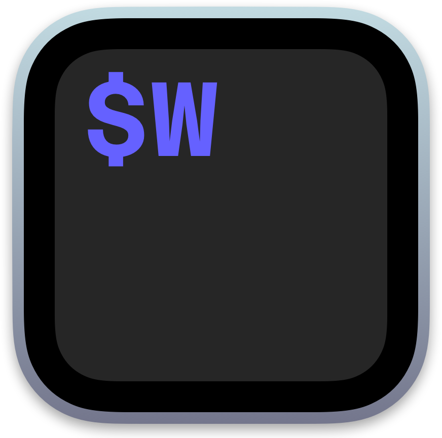
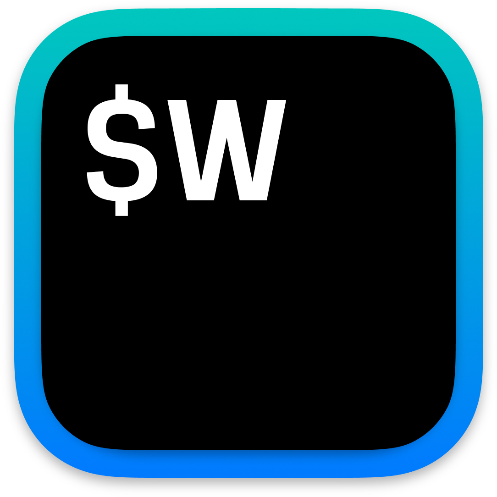
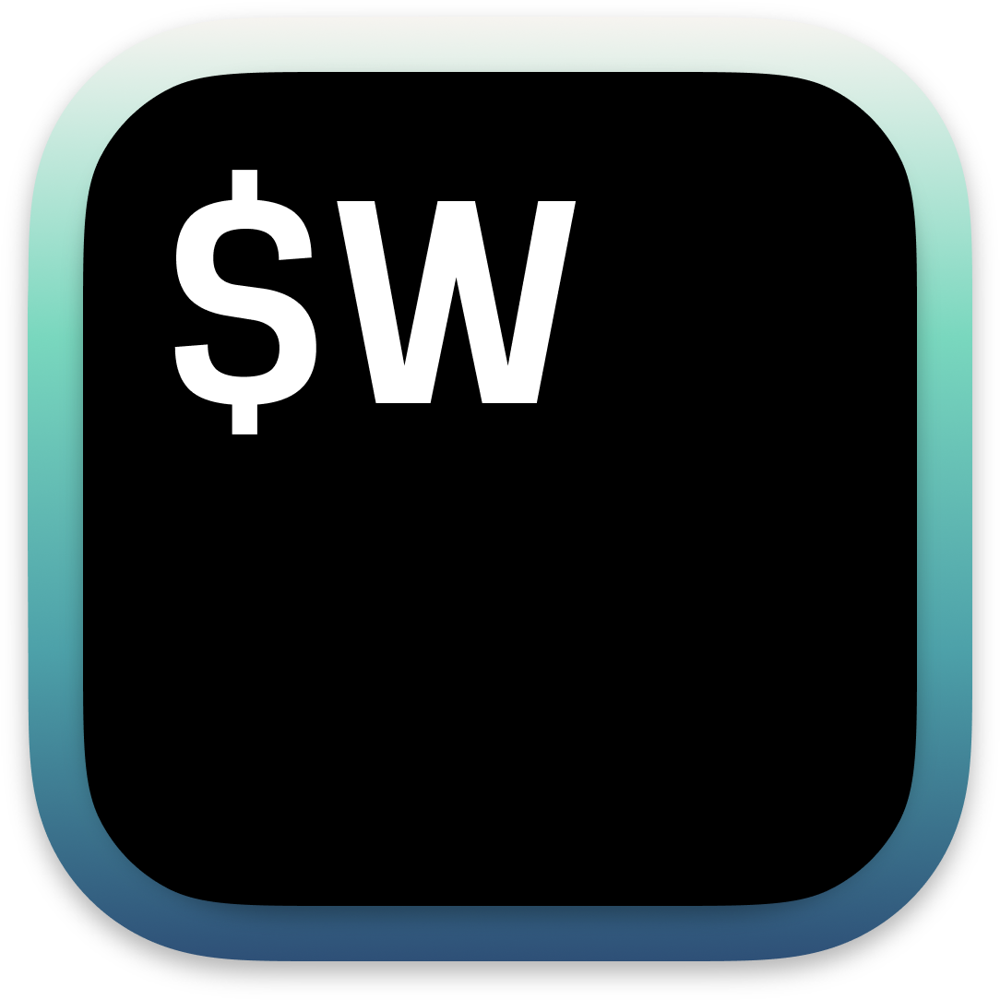
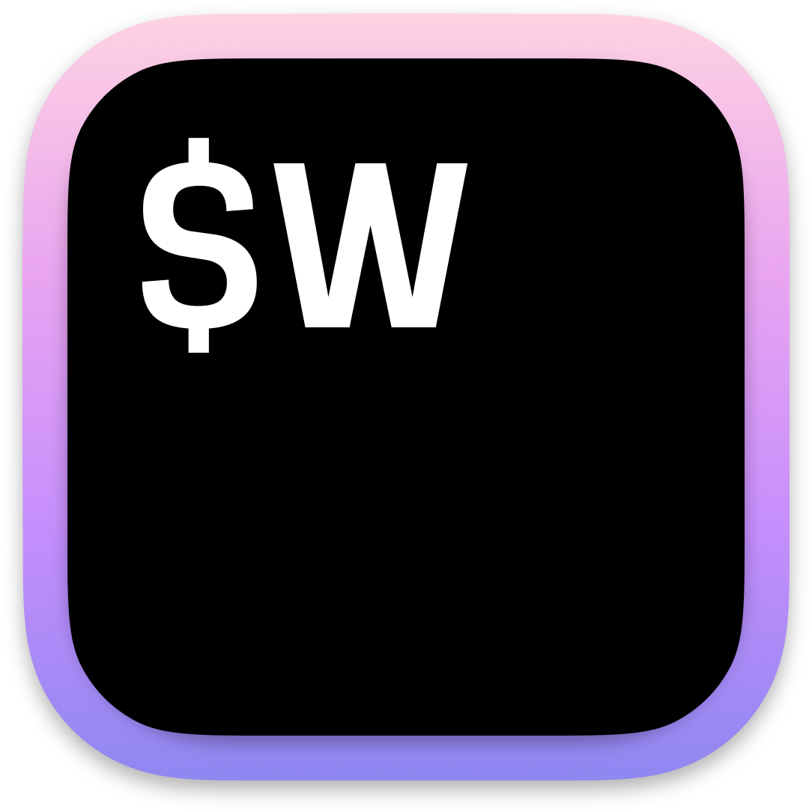
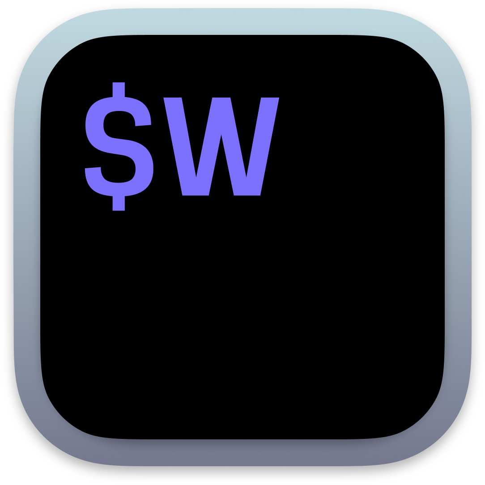

# WezTerm - Windows Builds with Alternative Icons

This repository automatically syncs with [wezterm/wezterm](https://github.com/wezterm/wezterm) to fetch the latest Windows zip distribution and creates custom builds with alternative icons.

For each custom icon listed below, we:
1. Create a patched version of `wezterm-gui.exe` with the icon
2. Package it as a separate Windows zip file

## Want to contribute an icon?

- Open a Pull Request with your PNG icon
- Icon requirements checklist:
  - Size between 400x400 and 1024×1024 pixels
  - PNG format
  - Transparent background
  - No unnecessary padding see `bin/unpad-all`

- Get support 👍 for your submission
  - Add previews to the PR discussion
  - Get commuinity feedback

## About These Icons

See original discussion: [wezterm/wezterm#2396](https://github.com/wezterm/wezterm/issues/2396)

> Special thanks to all icon creators for their contributions.
> If you're an icon creator and would like your work removed for any reason, please contact [@jasonm23](https://github.com/jasonm23) in the above thread.

## Available Alternate Icons

### Gf3-Shine

**Creator:** [@gf3](https://github.com/gf3)

### Mikker-Black

**Creator:** [@mikker](https://github.com/mikker)

### Grapao-Base

**Creator:** [@grapao](https://github.com/grapao)

### Grapao-Forest

**Creator:** [@grapao](https://github.com/grapao)

### Grapao-Green

**Creator:** [@grapao](https://github.com/grapao)

### Grapao-Pastel

**Creator:** [@grapao](https://github.com/grapao)

### Grapao-Original-Style

**Creator:** [@grapao](https://github.com/grapao)

