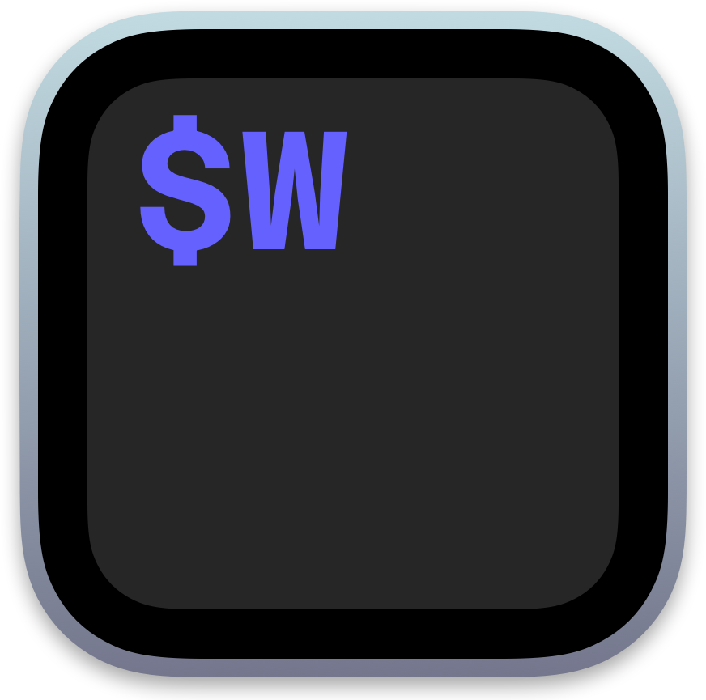 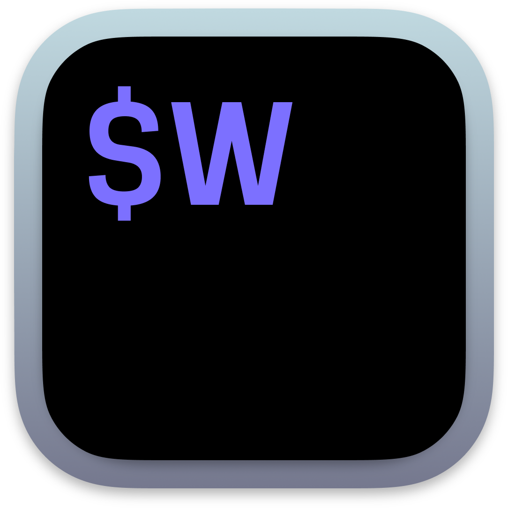 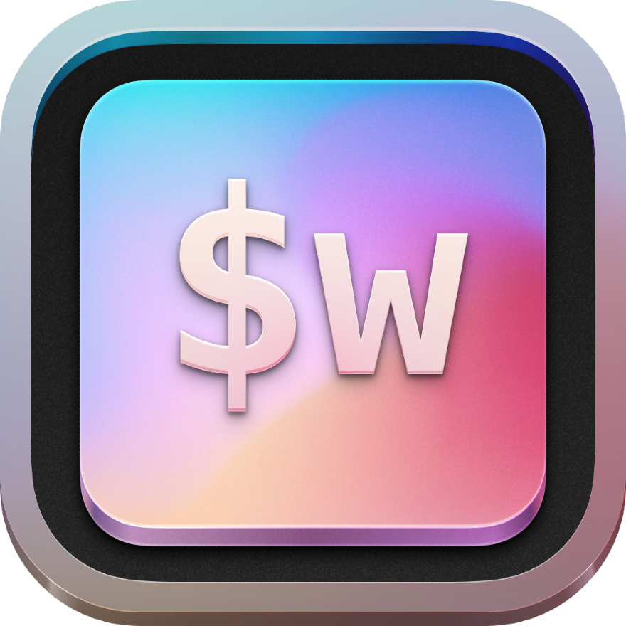   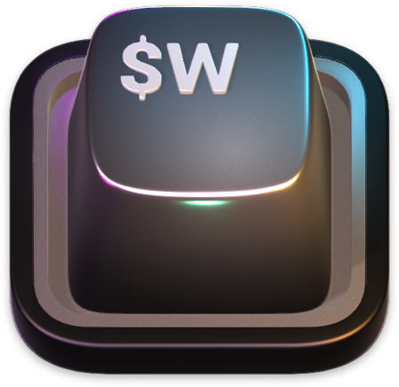  

# WezTerm - Windows Builds with Alternative Icons

### Quick Windows install via Scoop bucket

add the new custom scoop bucket

```
scoop bucket add wezterm-alt-icon https://github.com/ocodo/wezterm-alt-windows-icon-builds.git
scoop search wezterm # list all the icons
```
Then install a build of wezterm latest with icon 

```
# e.g. install mikker-black icon
scoop install wezterm-alt-icon/wezterm-mikker-black
```

Carry on reading for full info or go [check out the wezterm docs](https://wezterm.org)

# Full info:

This repository automatically syncs with [wezterm/wezterm](https://github.com/wezterm/wezterm) to fetch the latest Windows zip distribution and creates custom builds with alternative icons.

For each custom icon listed below, we:
1. Create a patched version of `wezterm-gui.exe` with the icon
2. Package it as a separate Windows zip file

## Want to contribute an icon?

If you'd like to add an icon, open a [new icon issue](https://github.com/ocodo/wezterm-alt-windows-icon-builds/issues/new?labels=new+icon) and assuming it passes quality controls/community interest (votes, socials, or I personally flip at how gorgeous it it!), it'll be integrated & added to the build/distribution process.

Make it a banger :+1:

## About These Icons

See original discussion: [wezterm/wezterm#2396](https://github.com/wezterm/wezterm/issues/2396)

> Special thanks to all icon creators for their contributions.
> If you're an icon creator and would like your work removed for any reason, please contact [@jasonm23](https://github.com/jasonm23) in the above thread.

## Available Alternate Icons

| | | | |
|-|-|-|-|
|  | Darkbrite-Deux <br /> [@gf3](https://github.com/gf3) | 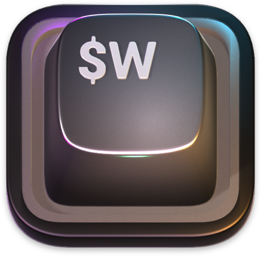 | Darkbrite-Une <br /> [@gf3](https://github.com/gf3) |
| 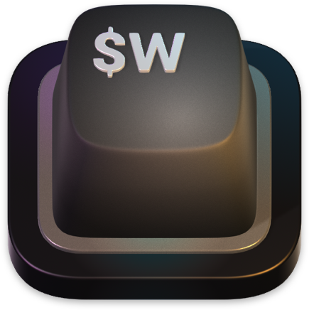 | Darksoft-Deux <br /> [@gf3](https://github.com/gf3) | 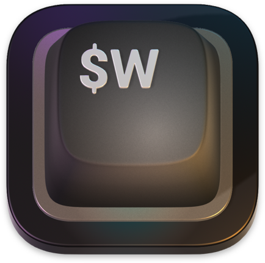 | Darksoft-Une <br /> [@gf3](https://github.com/gf3) |
| 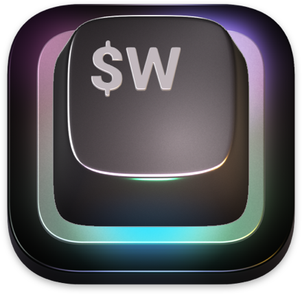 | Darkultra-Nueng <br /> [@gf3](https://github.com/gf3) | 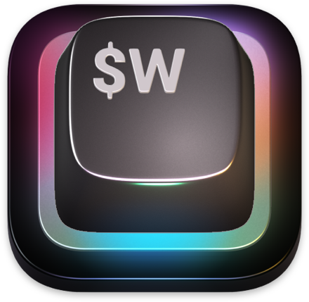 | Darkultra-Sam <br /> [@gf3](https://github.com/gf3) |
| 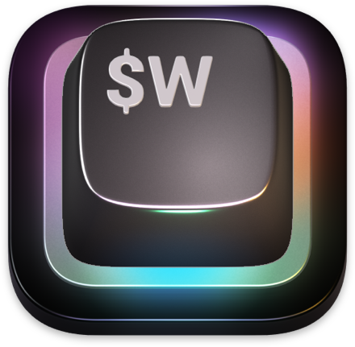 | Darkultra-Song <br /> [@gf3](https://github.com/gf3) |  | Shine <br /> [@gf3](https://github.com/gf3) |
|  | Ultrabrite <br /> [@gf3](https://github.com/gf3) | 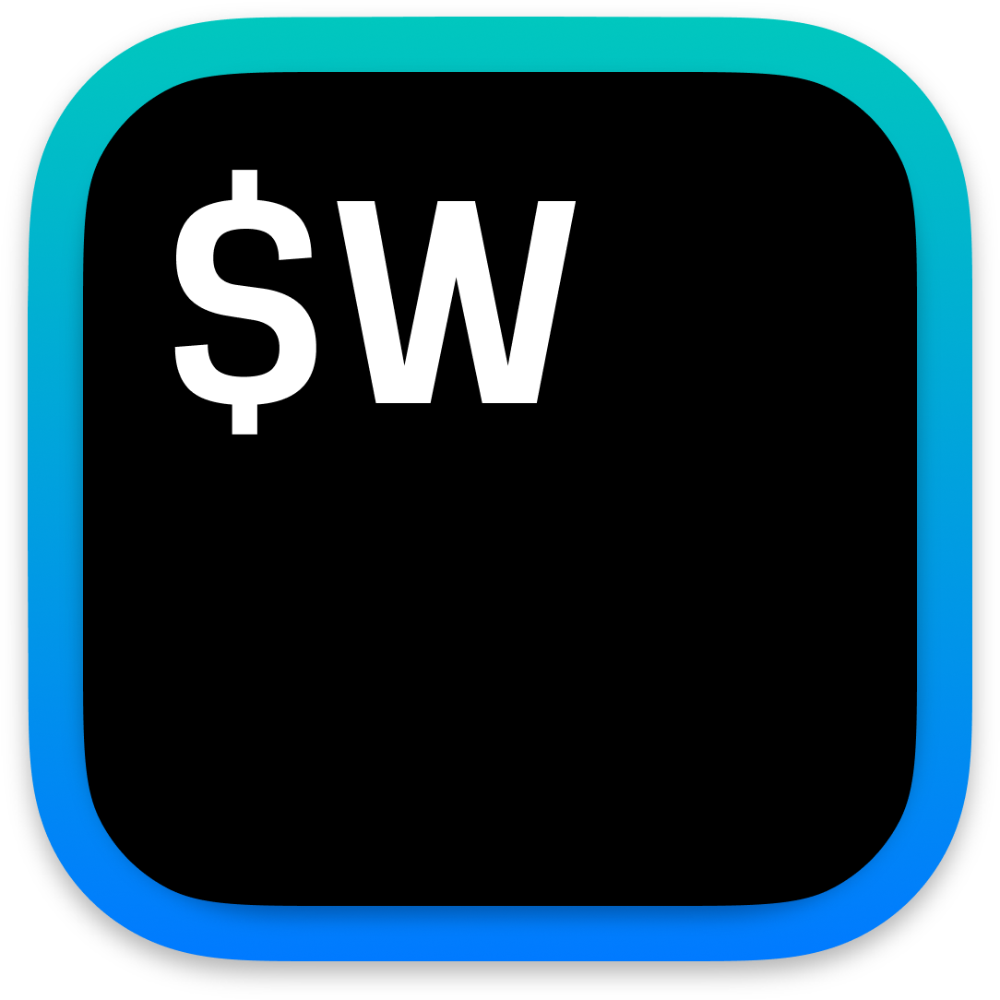 | Base <br /> [@grapao](https://github.com/grapao) |
| 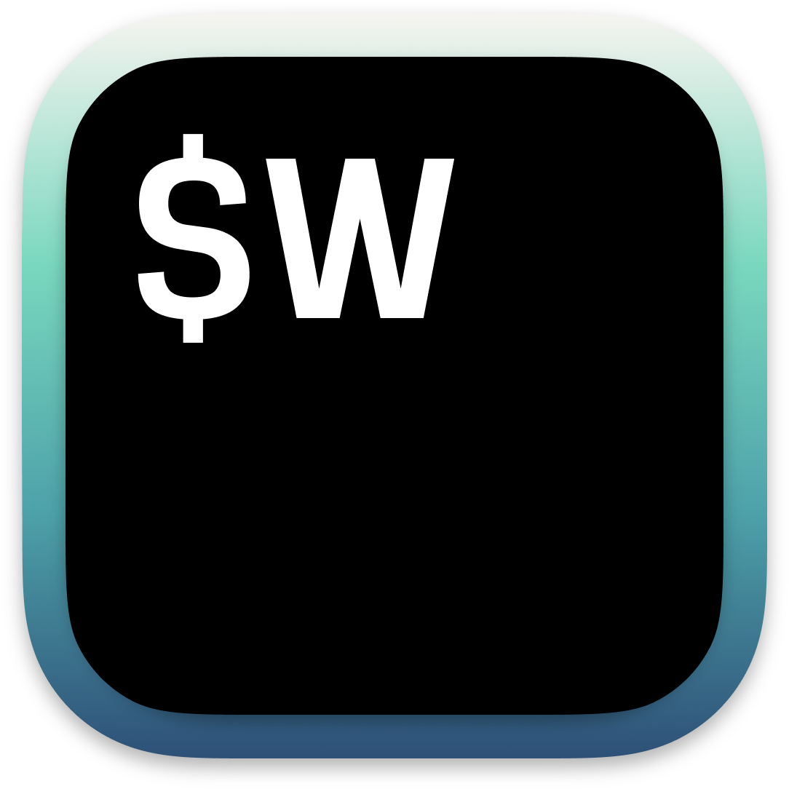 | Forest <br /> [@grapao](https://github.com/grapao) | 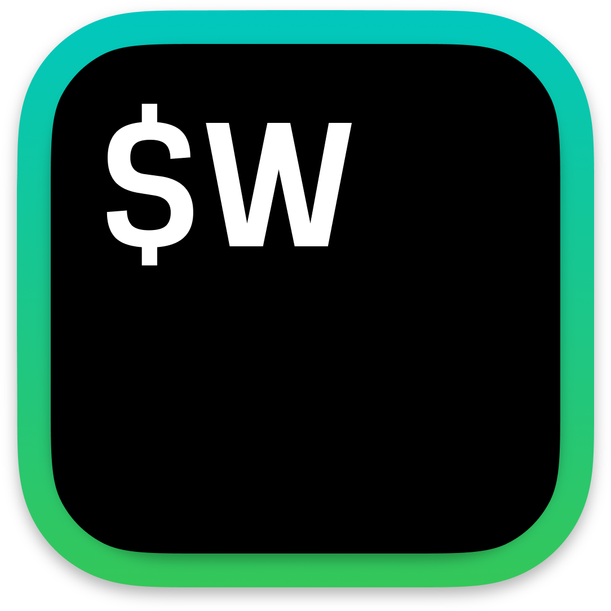 | Green <br /> [@grapao](https://github.com/grapao) |
|  | Original-Style <br /> [@grapao](https://github.com/grapao) | 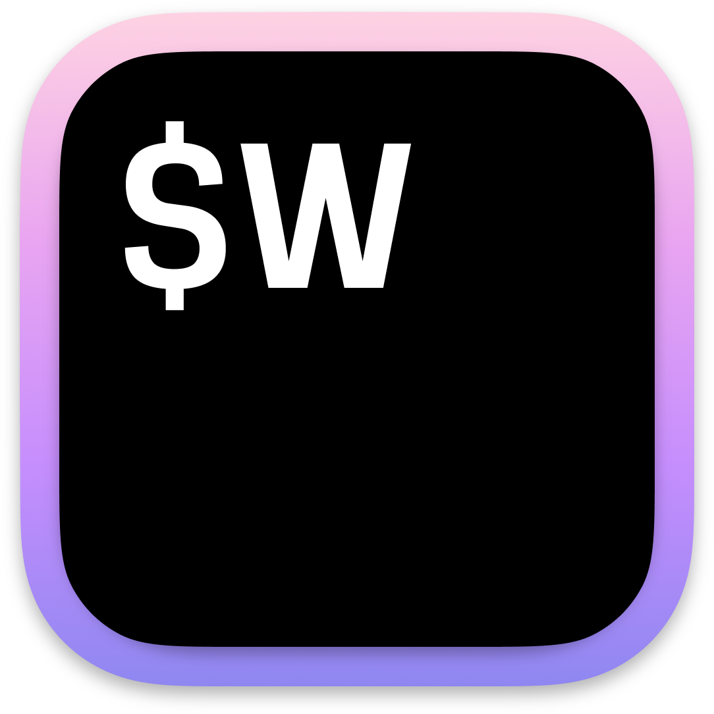 | Pastel <br /> [@grapao](https://github.com/grapao) |
|  | Black <br /> [@mikker](https://github.com/mikker) |  |  |

## Installation with Scoop

> [!IMPORTANT]
> [Scoop](https://scoop.sh/) provides an easy way to install and manage WezTerm icon variants on Windows.
> Make sure you have `scoop` installed first.

### Quick Start

First installation:

```sh
scoop bucket add wezterm-alt-icon https://github.com/ocodo/wezterm-alt-windows-icon-builds.git
scoop install wezterm-alt-icon/wezterm-mikker-black
```

To switch to a different icon, uninstall the current version and install the desired variant. Your WezTerm configuration files will be preserved during the switch.

```sh
scoop uninstall wezterm-alt-icon/wezterm-mikker-black
scoop install wezterm-alt-icon/wezterm-grapao-original-style
```

### Available Variants

The build names follow the pattern with lowercase: `wezterm-{artist}-{icon-name}`

Examples:

- Build Mikker-Black → `wezterm-mikker-black`
- Build Gf3-Darkbrite-une → `wezterm-gf3-darkbrite-une`
- Build Grapao-Original-Style → `wezterm-grapao-original-style`

Refer to the table above to find your preferred icon, then install using the corresponding build name.

