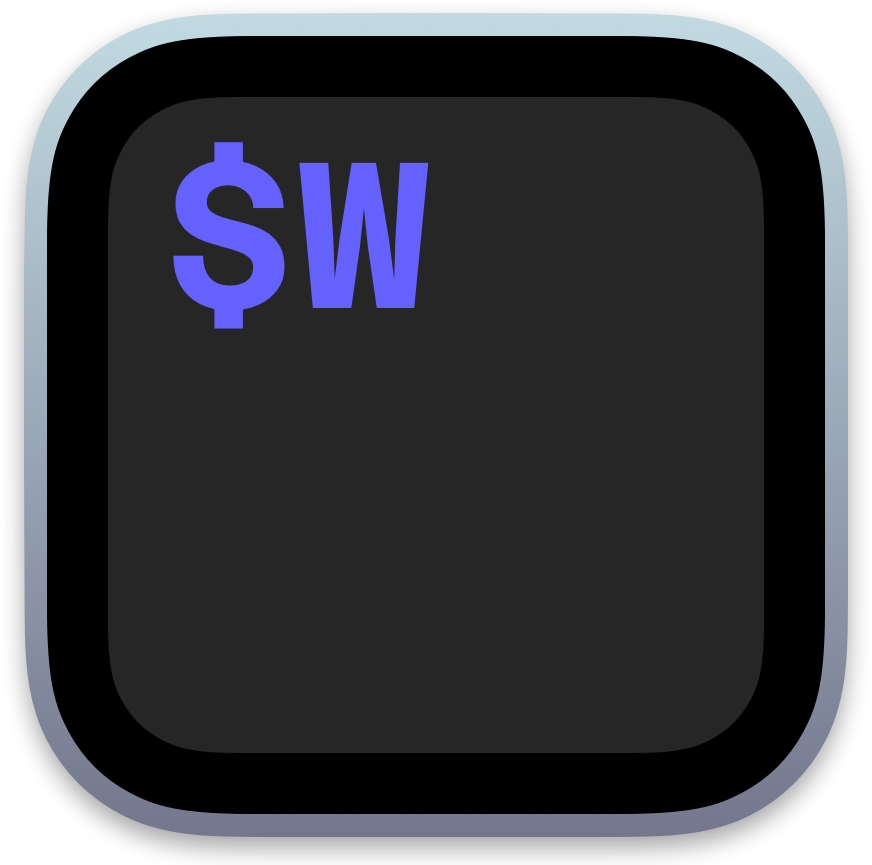
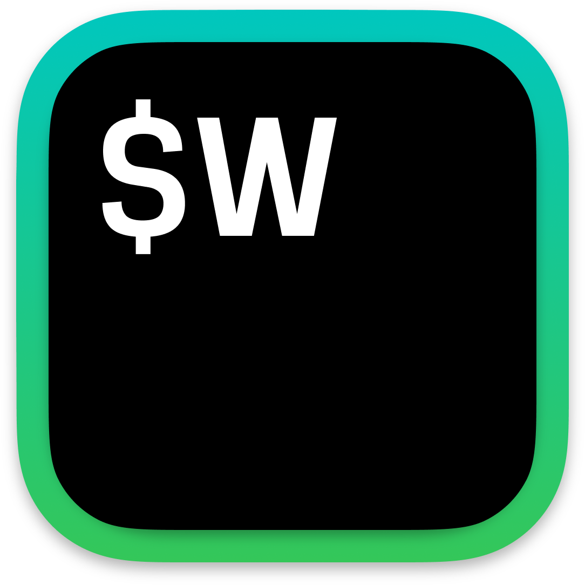

### Available Custom Icons

Here’s a preview of the icons you can choose from:

| | credit | | credit |
|-|-|-|-|
|  | Shine   [@gf3](https://github.com/gf3) |  | Black   [@mikker](https://github.com/mikker) |
|  | Base   [@grapao](https://github.com/grapao) |  | Forest   [@grapao](https://github.com/grapao) |
|  | Green   [@grapao](https://github.com/grapao) |  | Pastel   [@grapao](https://github.com/grapao) |
|  | Original Style   [@grapao](https://github.com/grapao) |

